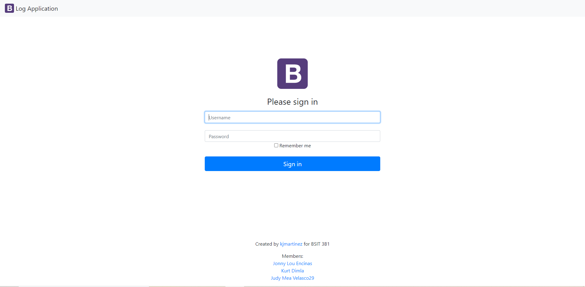
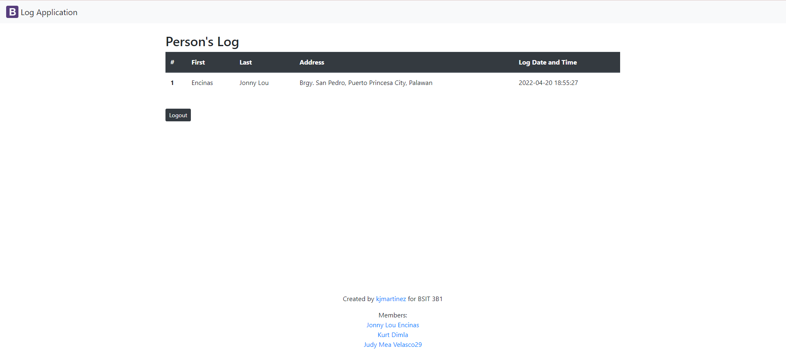
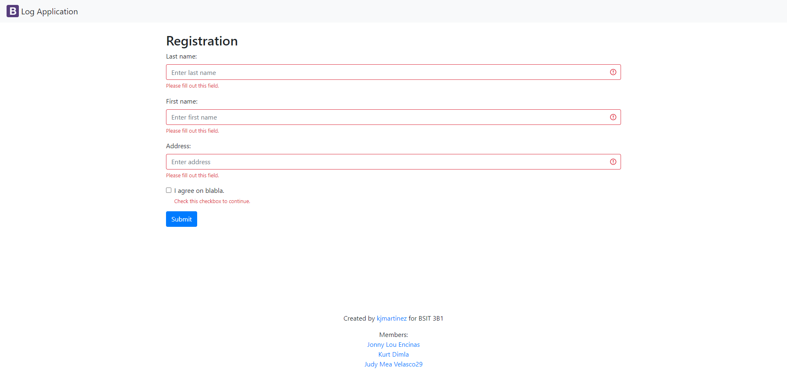

# Log Application
:black_nib: **Practice Set 10: Documentation** 

A simple web application with a login, list, and logout feature that only the Admin user has access to.
However, the form can be accessable by users and can input their data.
This project was created using PHP and HTML-CSS

***
[TOC]
***

## :computer: Screen Layouts

:link: **Login**


:page_with_curl: **List**


:memo: **Form**


***

## :file_folder:​ Installation / Preparation
1. Go to Github and copy the link of the remote repository named ***logApp-scaling-octo***.

2. Open Command Line Interface (CMD) by pressing Windows Key + R and type `cmd` .

3. Clone the remote repository (logApp-scaling-octo) to your local computer using this command line.
```
$ git clone [URL of the repository]
```
4. Move the cloned repository or now a folder to "C:\XAMPP\htdocs\" (if you are using XAMPP) or to "C:\WAMP\www\" (if you are using WampServer).

5. Open and start XAMPP or WampServer.

6. Open your browser and go to phpMyAdmin.
```
$ localhost/phpmyadmin
```
7. Import the database in phpmyadmin of the logApp named ***log_app.sql***.

8. Open your browser and go to "http://localhost/logApp-scaling-octo/index.php" for the forms and/or go to "http://localhost/logApp-scaling-octo/guestbook-login.php" to access the list of data.

9. You can now start to explore it such as add a data to the list and login an account to view the list.

***

## :busts_in_silhouette: Authors

:woman:   [**Jonny Lou L. Encinas**](https://github.com/JLouEncinas "Jonny Lou's Github Acct")


:man:   [**Kurt Dimla**](https://github.com/KDimla "Kurt's Github Acct")


:girl:   [**Judy Mea L. Velasco**](https://github.com/judvelasco29 "Judy's Github Acct")

